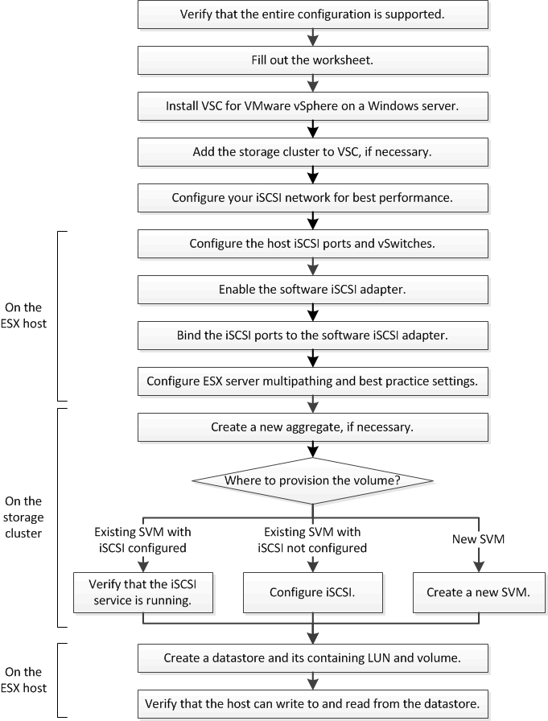

= iSCSI の構成ワークフロー
:icons: font
:imagesdir: ../media/

[role="lead"]
iSCSI を使用して ESX ホストでストレージを使用できるようにするには、 Storage Virtual Machine （ SVM ）で Virtual Storage Console for VMware vSphere を使用してボリュームと LUN をプロビジョニングし、ホストから LUN に接続します。

