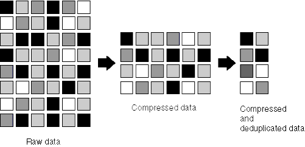

= データ圧縮と重複排除
:icons: font
:imagesdir: ../media/

[role="lead"]
Data ONTAP 8.0.1 以降では、重複排除とともにデータ圧縮がサポートされています。

FlexVol ボリュームでデータ圧縮機能と重複排除機能の両方を有効にすると、先にデータが圧縮されてから重複が排除されます。そのため、重複排除機能によって FlexVol 内の重複するブロックが削除され、スペースがさらに削減されます。

FlexVol でデータ圧縮機能と重複排除機能を有効にした場合の削減効果は、この 2 つをデータセットに対して個別に実行した場合の合計になるとはかぎりません。組み合わせて実行すると、重複排除やデータ圧縮を個別に実行した場合よりも高い効果が得られます。

データ圧縮スキャンを実行してから重複排除を実行すると、削減効果を高めることができます。データ圧縮スキャンは重複排除でロックされたデータに対しては実行できませんが、重複排除は圧縮されたデータに対しても実行できます。

次の図に、データを圧縮してから重複を排除する方法を示します。

圧縮されていないデータを含む FlexVol に対して重複排除を実行すると、 FlexVol ボリューム内の圧縮されていないブロックがすべてスキャンされ、それらのブロックのそれぞれについてデジタルフィンガープリントが作成されます。

[NOTE]
====
圧縮されたデータがある FlexVol ボリュームで圧縮オプションが無効になっている場合、「 is undo 」コマンドを実行するとスペースの削減効果が得られないことがあります。

====