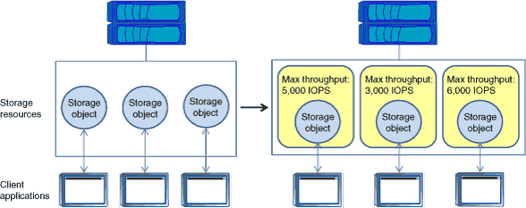

= ストレージ QoS の仕組み
:icons: font
:imagesdir: ../media/

[role="lead"]
ストレージ QoS は、クライアント処理（ SAN および NAS データ要求）とシステム処理のスロットリングと優先順位付けを行うことで、ポリシーグループに割り当てられるワークロードを制御します。

次の図は、ストレージ QoS の使用前と使用後の環境の例を示しています。左の図では、複数のワークロードが I/O を送信するためにクラスタリソースを奪い合っていますこれらのワークロードは「ベストエフォート」パフォーマンスを得るため、パフォーマンスの予測性が低くなります（たとえば、あるワークロードのパフォーマンスが高くなり、他のワークロードに悪影響を与える可能性があります）。右の図は、同じワークロードを、最大スループットを適用するポリシーグループにそれぞれ割り当てた状態を示しています。

max-throughput パラメータは ' ポリシー・グループの最大スループット制限を指定しますポリシー・グループはこの最大スループット制限を超えることはできませんこのパラメータには、 IOPS または MB/ 秒の値、あるいはその両方をカンマで区切って指定します。指定できる値はゼロ以上の任意の値です。

単位は 10 進数です。数字と単位の間にスペースは入れません。-max-throughput パラメータのデフォルト値は 'Infinit` であり ' INF という特別な値で指定されます

[NOTE]
====
-max-throughput パラメータにはデフォルトの単位はありません。ゼロまたは無制限以外の値を指定する場合は、単位を指定する必要があります。

====
キーワード「 none 」は、値を削除する必要がある場合に使用できます。使用可能な最大値を指定する必要がある場合は、キーワード "INF" を使用できます。有効なスループット仕様の例としては、 "`100B/s","10KB/s ","1gb/s ","500MB/s ","tb/s `","tb/s ," などがあります。 "`100iops`", "100iops,400KB/s ," および "800KB/s ,100iops")
