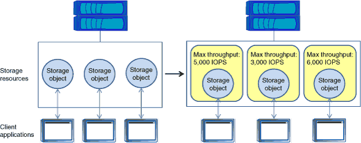

= ストレージ QoS を使用してワークロードパフォーマンスを管理します
:icons: font
:imagesdir: ../media/

[role="lead"]
ストレージ QoS は、パフォーマンス目標の達成に伴うリスクへの対応に役立ちます。ストレージ QoS を使用してワークロードに対するスループットを制限し、ワークロードのパフォーマンスを監視できます。パフォーマンスに関する問題に対処するために事後対応としてワークロードを制限することも、パフォーマンスに関する問題を防ぐために事前対応としてワークロードを制限することもできます。

ワークロードとは、次のいずれかの種類のストレージオブジェクトに対する入出力（ I/O ）処理のことです。

* FlexVol ボリューム
* LUN
* FlexGroup ボリューム

ストレージオブジェクトをポリシーグループに割り当てて、ワークロードの制御と監視を行うことができます。ワークロードを制御せずに監視することもできます。

次の図は、ストレージ QoS の使用前と使用後の環境の例を示しています。左の図では、複数のワークロードが I/O を送信するためにクラスタリソースを奪い合っていますこれらのワークロードは「ベストエフォート」パフォーマンスを得るため、パフォーマンスの予測性が低くなります（たとえば、あるワークロードのパフォーマンスが高くなり、他のワークロードに悪影響を与える可能性があります）。右の図では、同じワークロードがポリシーグループに割り当てられています。ポリシーグループによって最大スループット制限が適用されています。

